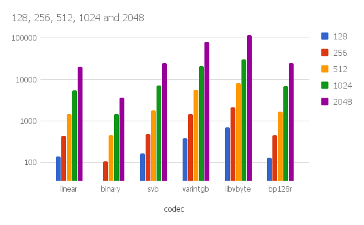

test for compressed data find over most powerful libs SIMDCompressionLib and libvbyte
======================

Some found results
------------------------

* Mac OS X [Intel Core i5 2.5Mhz]

More detailed results
------------------------
https://docs.google.com/spreadsheets/d/19fmeWMafaq1WTNicGb4fX7rTYgPWlOffMb0NiboodT8/edit?usp=sharing

Usage
------------------------

It can't be more simple:

    cmake && make

To run the bench:

    ./bit_bench

Licensing
------------------------

Apache License, Version 2.0

Requirements
------------------------

Tested on Linux and Mac OS X.

Acknowledgement
------------------------

This work is based on Daniel Lemire (http://lemire.me)'s ideas and
implementation at https://github.com/lemire/SIMDCompressionAndIntersection.

For further information, see
* Daniel Lemire, Christoph Rupp, Upscaledb: Efficient Integer-Key Compression in a Key-Value Store using SIMD Instructions, Information Systems 66, 2017. https://arxiv.org/abs/1611.05428
* Goldstein J, Ramakrishnan R, Shaft U. Compressing relations and indexes. Proceedings of the Fourteenth International Conference on Data Engineering, ICDE ’98, IEEE Computer Society: Washington, DC, USA, 1998; 370–379.
* Daniel Lemire and Leonid Boytsov, Decoding billions of integers per second through vectorization, Software Practice & Experience 45 (1), 2015.  http://arxiv.org/abs/1209.2137 http://onlinelibrary.wiley.com/doi/10.1002/spe.2203/abstract
* Daniel Lemire, Leonid Boytsov, Nathan Kurz, SIMD Compression and the Intersection of Sorted Integers, Software Practice & Experience (to appear) http://arxiv.org/abs/1401.6399
* Jeff Plaisance, Nathan Kurz, Daniel Lemire, Vectorized VByte Decoding, International Symposium on Web Algorithms 2015, 2015. http://arxiv.org/abs/1503.07387
* Wayne Xin Zhao, Xudong Zhang, Daniel Lemire, Dongdong Shan, Jian-Yun Nie, Hongfei Yan, Ji-Rong Wen, A General SIMD-based Approach to Accelerating Compression Algorithms, ACM Transactions on Information Systems 33 (3), 2015. http://arxiv.org/abs/1502.01916

